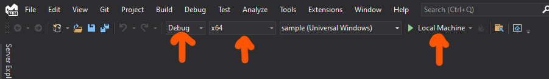

# Rush/PNPM and React Native Windows demo

## Intro

This repo demonstrates the problem of RNW apps with community modules (async-storage, for example).

An RNW app consists of two parts:

1. React Native part (JS/TS)
2. UWP part, written in C++/C# (native application, a shell)

A community module consists of two parts as well:

1. JS/TS API
2. C++/C# code

To see the RNW application running, next things have to happen:

1. UWP part is built
2. Community modules native implementation have to be built
3. JS/TS code of an app and a community module has to be built

When Rush uses PNPM, it creates long paths for the community module's native implementation source files, and that brakes (depending on the module's name length) UWP build process with the following errors, or similar.

Example long path to a community module (assuming this repo is cloned to be disk root):

```
C:\rush-pnpm-rnw\common\temp\\node_modules\.pnpm\@react-native-async-storage+async-storage@1.15.5_react-native@0.64.1\node_modules\@react-native-async-storage\\async-storage
```

And this is the error with what Visual Studio fails to build UWP part (`apps/Sample/windows` folder):

```
Error		The "MSBuild" task failed unexpectedly.
System.IO.PathTooLongException: The specified path, file name, or both are too long. The fully qualified file name must be less than 260 characters, and the directory name must be less than 248 characters.
   at System.IO.Path.LegacyNormalizePath(String path, Boolean fullCheck, Int32 maxPathLength, Boolean expandShortPaths)
   at System.IO.Path.InternalGetDirectoryName(String path)
   at Microsoft.Build.BackEnd.MSBuild.<ExecuteTargets>d__80.MoveNext()
--- End of stack trace from previous location where exception was thrown ---
   at System.Runtime.ExceptionServices.ExceptionDispatchInfo.Throw()
   at System.Runtime.CompilerServices.TaskAwaiter.HandleNonSuccessAndDebuggerNotification(Task task)
   at Microsoft.Build.BackEnd.MSBuild.<BuildProjectsInParallel>d__77.MoveNext()
--- End of stack trace from previous location where exception was thrown ---
   at System.Runtime.ExceptionServices.ExceptionDispatchInfo.Throw()
   at System.Runtime.CompilerServices.TaskAwaiter.HandleNonSuccessAndDebuggerNotification(Task task)
   at System.Runtime.CompilerServices.TaskAwaiter`1.GetResult()
   at Microsoft.Build.BackEnd.MSBuild.<ExecuteInternal>d__76.MoveNext()
--- End of stack trace from previous location where exception was thrown ---
   at System.Runtime.ExceptionServices.ExceptionDispatchInfo.Throw()
   at System.Runtime.CompilerServices.TaskAwaiter.HandleNonSuccessAndDebuggerNotification(Task task)
   at Microsoft.Build.BackEnd.TaskBuilder.<ExecuteInstantiatedTask>d__26.MoveNext()	sample
```

## How to reproduce

Please follow next steps:

1. `rush install` to install dependencies of monorepo
2. `cd apps/Sample`
3. `npx react-native autolink-windows` to autolink community modules
4. `start ./windows/sample.sln` to start Visual Studio
5. Select Configuration, Architecture and press the green "Play" button:



To see if it's working with when a packager is Yarn, checkout to `yarn` branch, and follow the same steps. There will no build errors in VS.

### Warning

This repo only demonstrates how to reproduce the UWP build build error. Building JavaScript code with Metro bundler is a separate challenge that I previously solved by replacing Metro with [repack](https://github.com/callstack/repack) (previously known as Haul), which I did not include in this repo. So don't try to see the Sample App UI because Metro will fail to build JS part anyway :)
